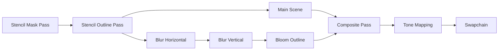
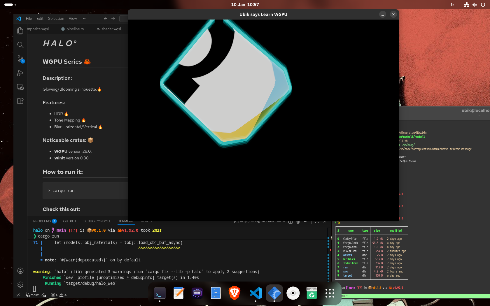

# _H A L O_ °

## **WGPU** Series  🦀

### Description:

Glowing/Blooming silhouette.🔥


### Features:

* HDR 🔥
* Tone Mapping 🔥
* Blur Horizontal/Vertical 🔥

### Noticeable crates: 📦


* **WGPU** version 28.0.
* **Winit** version 0.30. 

### Techniques:



## **How to run it:**

```bash
> cargo run
```

For web browser:

```bash
> trunk serve 
```
and I use **Caddy** to serve static files with CORS.

So on *Linux*:

```bash
> sudo caddy run --config Caddyfile --adapter caddyfile 
```
**Important Note:**
If you run MSAA (i.e sample = 4), you need to run the code in a browser that supports **WEBGPU**. For example: [Firefox Nightly](https://nightly.mozfr.org/)

### **Check this out:** 




