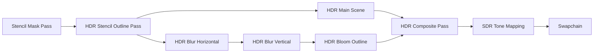

# _G L O W_  ,~*

_Jan 2026_

## **WGPU** Series  🦀

### Description:

Glowing/Blooming silhouette & edges.🔥


### Features:

* HDR 🔥
* Tone Mapping 🔥
* Blur Horizontal/Vertical 🔥

### Versions I used:

cargo 1.92.0 

Developped on [**Rocky Linux**](https://rockylinux.org/) 10.1

### Noticeable crates: 📦


* **WGPU** version 28.0.
* **Winit** version 0.30. 

### Techniques:



## **How to run it:**

```bash
> cargo run
```

For web browser:

```bash
> trunk serve 
```
and I use **Caddy** to serve static files with CORS.

So on *Linux*:

```bash
> sudo caddy run --config Caddyfile --adapter caddyfile 
```
**Important Note:**
If you run MSAA (i.e sample = 4), you need to run the code in a browser that supports **WEBGPU**. For example: [Firefox Nightly](https://nightly.mozfr.org/)

### **Check this out:** 

![Watch the pic]


